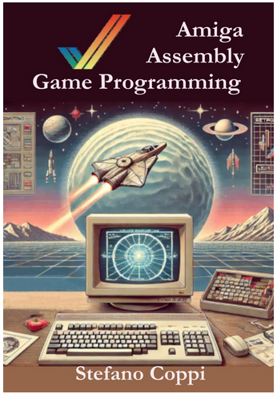

# Amiga ASM sous Linux

# [Amiga Assembly Game Programming](https://www.amazon.com/dp/B0DS9P3T8V)

Vous souhaitez apprendre à programmer directement le **Commodore Amiga** en **assembleur Motorola 68000** et comprendre comment étaient développés les jeux de cette machine mythique ?

**Amiga Assembly Game Programming** de **Stefano Coppi** est un guide pratique qui vous accompagne pas à pas dans la création d'un véritable jeu de type **Shoot'em Up** tout en découvrant les composants matériels spécifiques de l'Amiga.



Le livre commence par les bases de l'assembleur 68000 avant d'aborder progressivement les techniques utilisées dans les jeux commerciaux de l'époque.

## Au programme

- Les bases de l'assembleur Motorola 68000
- L'architecture du Commodore Amiga
- Les bitplanes
- Les Copper Lists
- La programmation du Blitter
- Les sprites matériels
- Les interruptions
- Le scrolling horizontal et vertical
- Le double buffering
- L'animation
- Les collisions
- Les effets graphiques
- La réalisation complète d'un Shoot'em Up

Tous les exemples sont expliqués étape par étape afin de comprendre non seulement **comment** ils fonctionnent, mais également **pourquoi** ils sont conçus de cette manière.

Que vous soyez passionné de rétro-informatique, développeur, membre de la demoscene ou simplement curieux de découvrir les techniques de programmation des jeux Amiga, ce livre constitue une excellente introduction à la programmation bas niveau sur cette machine légendaire.


## Démonstration vidéo

Découvrez le jeu développé tout au long du livre :

https://youtu.be/Lm_MZd6v7m0

Bon développement sur Amiga !


**Auteur :** Edwin Th. van den Oosterkamp


---

## Présentation

La programmation **bare-metal** consiste à écrire des logiciels qui communiquent directement avec le matériel, sans passer par le système d'exploitation.

Sur **Amiga**, même si **AmigaOS** est un système multitâche très performant, la majorité des jeux et des démos accèdent directement au matériel. Cette approche permet d'obtenir de meilleures performances et d'exploiter pleinement les possibilités des circuits spécialisés (Custom Chips).

L'ensemble des exemples du livre peut être développé et compilé sous **Linux** grâce aux outils modernes tels que **vasm**, **vlink** et **vbcc**, ce qui évite de devoir programmer directement sur un Amiga.

---

## Contenu du livre

Le livre explique comment programmer directement le matériel des Amiga équipés des chipsets :

- OCS (Original Chip Set)
- ECS (Enhanced Chip Set)
- AGA (Advanced Graphics Architecture)

Chaque partie du matériel est étudiée en détail avec des exemples pratiques.

Les principaux sujets abordés sont :

- architecture matérielle de l'Amiga ;
- registres des Custom Chips ;
- le Copper ;
- le Blitter ;
- les sprites matériels ;
- les playfields ;
- le matériel audio ;
- le contrôleur de disquette ;
- les interruptions ;
- les joysticks ;
- la souris ;
- les paddles ;
- le clavier.

---

## Prérequis

Pour profiter pleinement du livre, il est recommandé de connaître :

- le langage assembleur Motorola 68000 (680x0) ;
- les bases de l'architecture de l'Amiga.

Une connaissance d'AmigaOS et du Workbench est utile, mais n'est pas indispensable puisque la programmation est réalisée en **bare-metal**, c'est-à-dire sans utiliser le système d'exploitation.

---

## Adaptation pour Linux

Tous les exemples peuvent être développés sous Linux avec les outils suivants :

- **vasm** : assembleur Motorola 68000
- **vlink** : éditeur de liens
- **vbcc** : compilateur C compatible Amiga

Cette approche permet :

- d'écrire le code avec un éditeur moderne ;
- de compiler rapidement les programmes ;
- de tester les exécutables dans un émulateur comme **FS-UAE** ou **WinUAE** ;
- de transférer ensuite les exécutables sur un véritable Amiga si nécessaire.

Cette chaîne de développement est aujourd'hui l'une des plus simples et des plus efficaces pour apprendre la programmation bas niveau de l'Amiga.

# Bienvenue

Ces fichiers contiennent les exemples de code accompagnant le livre :

> **Bare-Metal Amiga Programming**  
> ISBN : **9798561103261**

Si vous avez acheté le livre, merci beaucoup pour votre confiance. J'espère que sa lecture vous permettra de mieux comprendre la programmation bas niveau de l'Amiga et vous donnera envie de créer vos propres jeux, démos ou utilitaires.

Si vous ne possédez pas encore le livre, ces exemples peuvent malgré tout être utilisés. Toutefois, certaines parties seront plus faciles à comprendre en s'appuyant sur les explications du livre.

---

# Utilisation

La plupart des sources assembleur utilisent des ressources externes (images, sons, données, etc.) qui sont chargées lors de l'assemblage.

Les exemples supposent que les fichiers sont organisés de la manière suivante :

```text
BareMetal:
├── Assets/
└── Sources/
```

Les ressources sont donc recherchées dans :

```text
BareMetal:Assets
```

## Utilisation de l'image ADF

Si vous utilisez directement l'image **ADF** (ou une disquette créée à partir de celle-ci), le nom du volume est déjà correct et aucune configuration supplémentaire n'est nécessaire.

## Utilisation des fichiers LHA ou d'un autre répertoire

Si vous avez extrait les fichiers dans un autre dossier, il faut créer un **Assign** afin que l'assembleur retrouve les ressources.

Par exemple :

```amiga
assign BareMetal: DH0:Sources/Book
```

Remplacez :

```text
DH0:Sources/Book
```

par le chemin où vous avez installé les exemples.

Pour éviter de saisir cette commande à chaque démarrage, vous pouvez l'ajouter dans :

```text
S:User-Startup
```

---

# Les exemples

Les exemples du livre privilégient la **lisibilité** plutôt que l'optimisation.

L'objectif est de faciliter la compréhension du fonctionnement du matériel Amiga, même si certaines routines pourraient être plus rapides ou plus compactes.

Une fois les concepts assimilés, libre à chacun d'optimiser les routines selon ses besoins.

---

# Mises à jour

De nouveaux exemples ou des corrections pourront être publiés au fil du temps.

La dernière version est disponible sur le site de l'auteur :

http://www.edsa.uk/downloads

---

# Remarque

Dans ce projet, les exemples ont été adaptés afin de pouvoir être développés sous **Linux** à l'aide d'une chaîne d'outils moderne :

- **vasm** : assembleur Motorola 68000
- **vlink** : éditeur de liens
- **vbcc** : compilateur C

Cette approche permet de développer confortablement sous Linux, puis de tester les exécutables dans un émulateur ou sur un véritable Amiga.

---

**Auteur du livre :**

**Edwin van den Oosterkamp**  
Worcester (Royaume-Uni)

