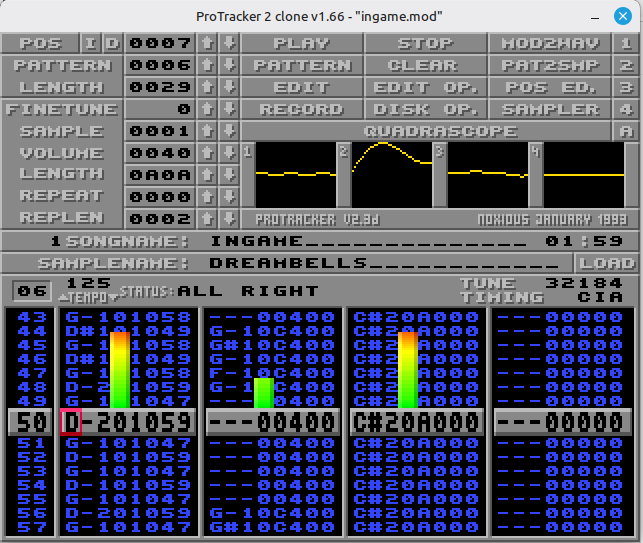
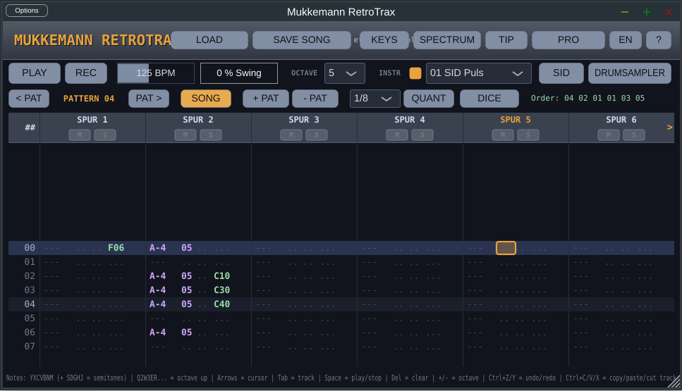

# Les fichiers mod sous linux

# PT2-Clone (ProTracker 2 Clone) sous Ubuntu / Linux

## Présentation

PT2-Clone est une réécriture fidèle de **ProTracker 2.3D**, le célèbre tracker de l'Amiga.
Il permet de créer et lire des modules au format **MOD** tout en reproduisant très fidèlement le comportement et le son du ProTracker d'origine, avec quelques améliorations modernes.



Projet officiel :

[GitHub - 8bitbubsy/pt2-clone](https://github.com/8bitbubsy/pt2-clone)
---

# Installation sous Ubuntu

Installer le paquet disponible dans les dépôts :

```bash
sudo apt update
sudo apt install pt2-clone
```

Le paquet installe également quelques dépendances (SDL2, documentation, etc.).

---

# Nom de l'exécutable

Contrairement au nom du paquet (`pt2-clone`), l'exécutable installé se nomme :

```bash
protracker
```

Pour vérifier :

```bash
which protracker
```

Résultat attendu :

```text
/usr/bin/protracker
```

On peut également afficher les fichiers installés :

```bash
dpkg -L pt2-clone
```

On retrouve notamment :

```text
/usr/bin/protracker
/usr/share/applications/protracker.desktop
/usr/share/icons/protracker.png
```

---

# Lancement

Depuis un terminal :

```bash
protracker
```

Ou depuis le menu des applications en recherchant :

```
ProTracker
```

---

# Aide

Afficher les options disponibles :

```bash
protracker --help
```

Afficher la documentation :

```bash
man protracker
```

---

# Désinstallation

Supprimer uniquement le programme :

```bash
sudo apt remove pt2-clone
```

Supprimer également les dépendances devenues inutiles :

```bash
sudo apt autoremove
```

---

# Remarques

- Compatible avec les modules **MOD** de l'Amiga.
- Interface très proche de ProTracker 2.3D.
- Convient aussi bien pour la composition que pour la lecture de modules.
- Fonctionne sous Linux, Windows et macOS.

---

# RetroTrax sous Linux

## Présentation

RetroTrax est un tracker audio moderne inspiré de **ProTracker**, **FastTracker II** et **OctaMED**. Il est distribué gratuitement en open source et fonctionne sous Linux, Windows et macOS. Il est disponible en version autonome (Standalone), VST3 et CLAP. 



Projet (versions) :

https://github.com/Mukkemann1972/retrotrax/releases

---

# Installation

1. Télécharger la dernière archive ZIP depuis la page des versions :

https://github.com/Mukkemann1972/retrotrax/releases

2. Décompresser l'archive.

Par exemple :

```bash
cd ~/Téléchargements
unzip RetroTrax-*.zip
```

L'arborescence obtenue est similaire à :

```text
retrotrax/
├── CLAP/
├── Standalone/
└── VST3/
```

---

# Exécution

Se placer dans le dossier **Standalone** :

```bash
cd ~/Téléchargements/retrotrax/Standalone
```

Afficher son contenu :

```bash
ls
```

Résultat :

```text
Mukkemann RetroTrax
```

Lancer le programme :

```bash
./Mukkemann\ RetroTrax
```

ou

```bash
"./Mukkemann RetroTrax"
```

---

# Installation permanente (optionnelle)

Pour rendre RetroTrax accessible depuis n'importe quel terminal :

```bash
sudo mkdir -p /opt/retrotrax
sudo cp -r ~/Téléchargements/retrotrax/* /opt/retrotrax/
sudo ln -s "/opt/retrotrax/Standalone/Mukkemann RetroTrax" /usr/local/bin/retrotrax
```

Le programme pourra ensuite être lancé avec :

```bash
retrotrax
```

---

# Désinstallation

Supprimer simplement le dossier et le lien symbolique :

```bash
sudo rm -f /usr/local/bin/retrotrax
sudo rm -rf /opt/retrotrax
```

---

# Remarques

- Aucune installation n'est nécessaire pour utiliser la version Standalone.
- Il suffit de télécharger l'archive ZIP, de la décompresser puis d'exécuter le programme.
- Les dossiers **VST3** et **CLAP** contiennent les versions destinées aux stations de travail audio (DAW) compatibles.
- RetroTrax est en développement actif et de nouvelles fonctionnalités sont ajoutées régulièrement. 


