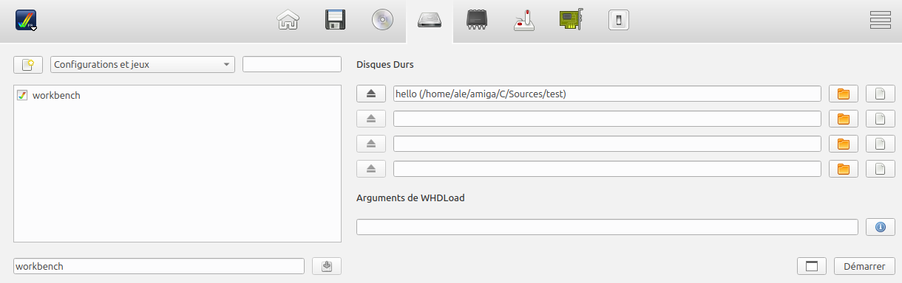
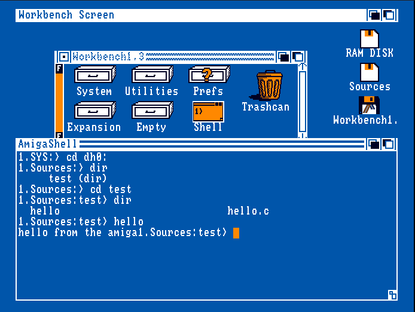

## Amiga C with Linux

vcm must be executable

```console
chmod +x ~/amiga/C/Linux/vbcc/bin/*
or
cd ~/amiga/C/Linux/vbcc/bin
chmod +x *
```

add PATH directory

```console
nano ~/.bashrc
```

add ligne
```console
export PATH=$HOME/amiga/C/Linux/vbcc/bin:$PATH
```

Save ctrl+o , ctrl+x

reload 
```console
source ~/.bashrc
```

go into test c source directory

```console
cd ~/amiga/C/Sources/test
vca hello.c hello.o
Compilation réussie : exécutable hello généré.
```

to resume :

```console
ale@ale-desktop:~/amiga/C$ cd Linux/
ale@ale-desktop:~/amiga/C/Linux$ ls
BuildVbccTools  vbcc
ale@ale-desktop:~/amiga/C/Linux$ cd vbcc/
ale@ale-desktop:~/amiga/C/Linux/vbcc$ cd bin/
ale@ale-desktop:~/amiga/C/Linux/vbcc/bin$ ls
dtgen  vasmm68k_mot  vasmm68k_stdm68k  vbccm68k  vc  vca  vlink  vprof
ale@ale-desktop:~/amiga/C/Linux/vbcc/bin$ chmod +x *
ale@ale-desktop:~/amiga/C/Linux/vbcc/bin$ nano ~/.bashrc
add  export PATH=$HOME/amiga/C/Linux/vbcc/bin:$PATH ans save
ale@ale-desktop:~/amiga/C/Linux/vbcc/bin$ source ~/.bashrc
ale@ale-desktop:~/amiga/C/Linux/vbcc/bin$ cd ~/amiga/C/Sources/test
ale@ale-desktop:~/amiga/C/Sources/test$ ls
ale@ale-desktop:~/amiga/C/Sources/test$ vca
Usage: vcm <nom_fichier.c>
ale@ale-desktop:~/amiga/C/Sources/test$ vca hello.c hello.o
Compilation réussie : exécutable hello généré.
ale@ale-desktop:~/amiga/C/Sources/test$ ls
hello  hello.c
ale@ale-desktop:~/amiga/C/Sources/test$
```
## Run on FS-UAE

- In FS-UAE, add virtual hard drive on dh0: (1st line)
- Select sources directory



- When workbench is loaded, run Shell
```console
cd dh0:
dir
cd test
dir
hello
```



## Amiga C with Windows

- Amiga C C++ Assembler development on Windows using MS Visual Studio Code

[lien YT](https://www.youtube.com/watch?v=x6Sw07ZQxXk


## About C for Amiga

[tuto](http://obligement.free.fr/articles/amigacmanual_0_introduction.php)
