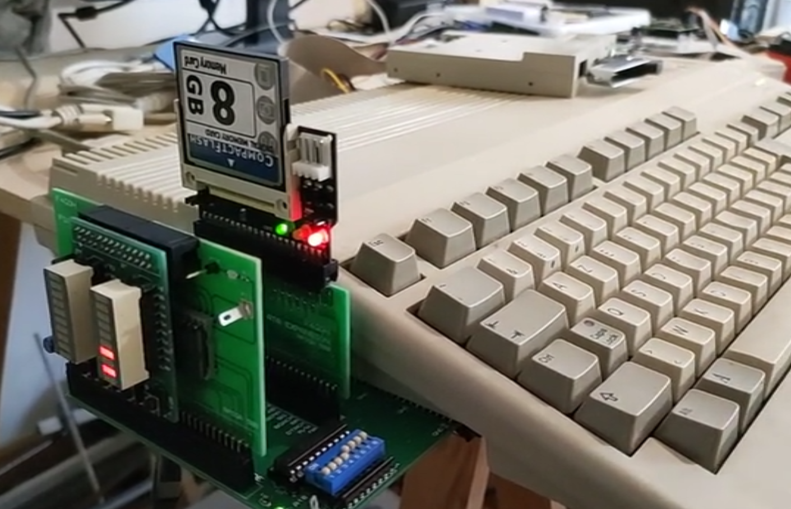
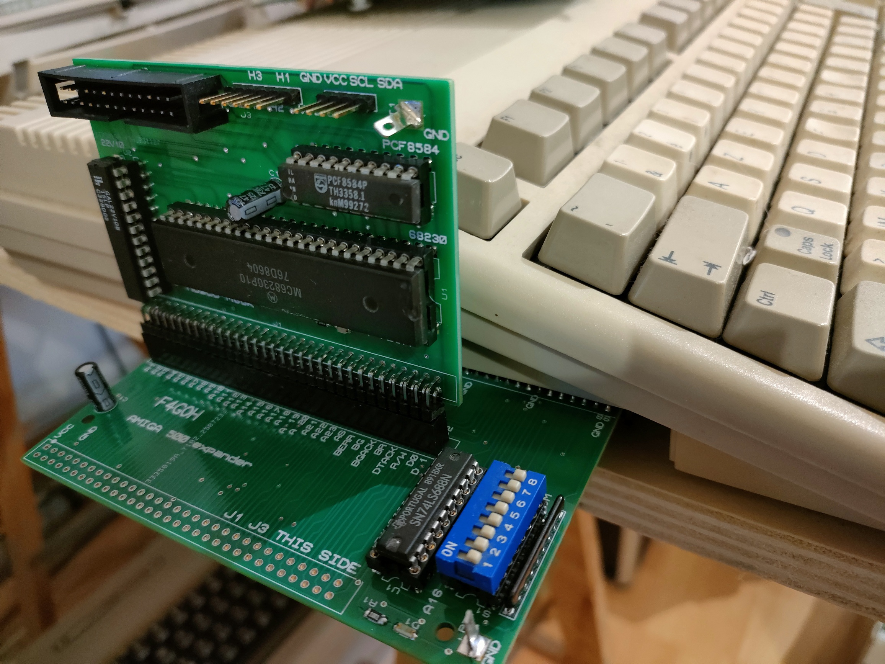
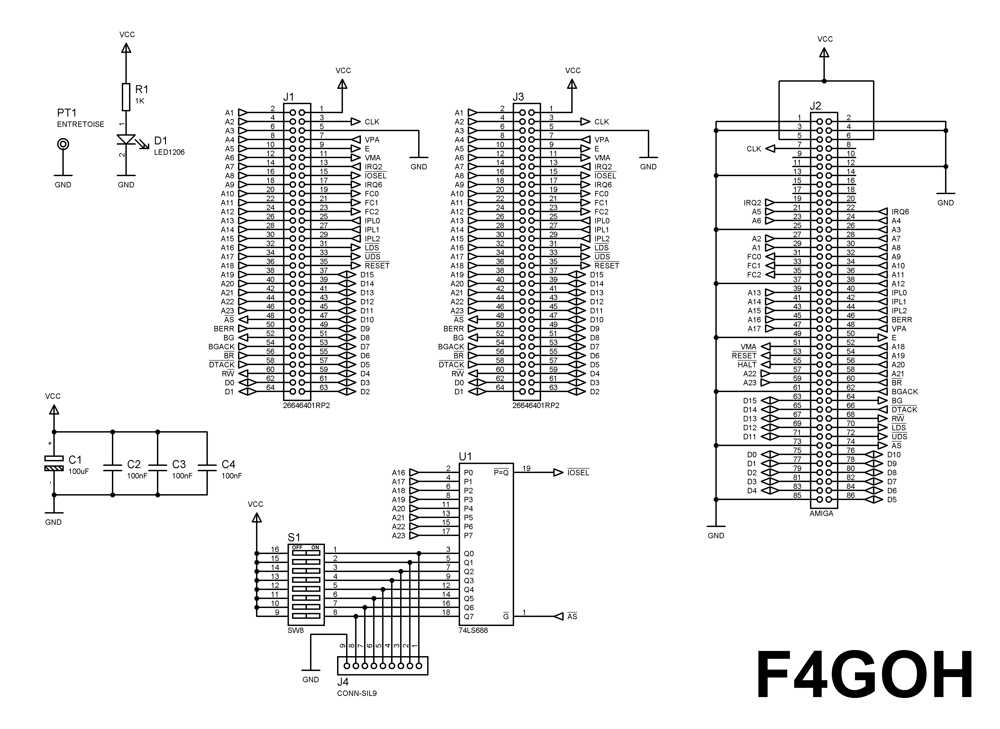
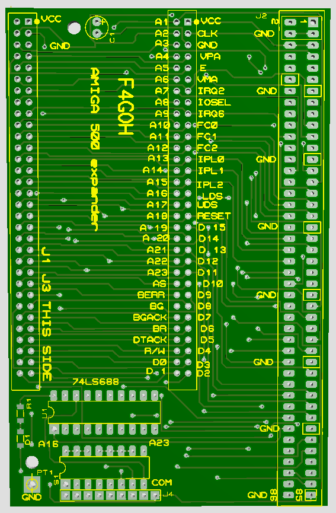

# Amiga 500 — Doubleur de port d'extension avec décodage d'adresse

## Description

Ce projet permet de connecter deux cartes d'extension sur le port d'extension de l'Amiga 500.

Le montage distribue le bus d'extension de l'Amiga vers deux connecteurs de sortie :

- J1 : carte d'extension n°1
- J3 : carte d'extension n°2
- J2 : connexion au port d'extension de l'Amiga 500

Le projet intègre également un décodage d'adresse configurable permettant de sélectionner une valeur d'adresse sur les lignes A16 à A23.

## Caractéristiques principales

- Double sortie pour cartes d'extension Amiga 500.
- Connexion au port d'extension de l'Amiga 500.
- Deux connecteurs pour cartes d'extension.
- Décodage d'adresse sur 8 bits.
- Utilisation des lignes A23 à A16.
- Sélection de l'adresse par DIP-switch 8 positions.
- Comparateur 74HCT688.
- Sortie d'égalité /P=Q active à l'état bas.
- 256 valeurs d'adresse sélectionnables.
- Découplage de l'alimentation par quatre condensateurs de 100 nF.
- LED d'indication d'alimentation.
- Montage destiné aux expérimentations et au développement de cartes d'extension Amiga 500.

---

# Amiga 500 — Doubleur de port + décodage d'adresse

**Port d'entrée :** port d'extension Amiga 500  
**Sorties :** 2 connecteurs pour cartes d'extension  
**Comparateur :** 74HCT688  
**Sélection :** DIP-switch 8 positions  
**Lignes décodées :** A23 à A16  
**Nombre de valeurs sélectionnables :** 256  
**Sortie de comparaison :** /P=Q, active à l'état bas

---

## Architecture générale

    AMIGA 500
        |
        | PORT D'EXTENSION
        v
       J2
        |
        +-------------------+
        |                   |
        v                   v
       J1                  J3
        |                   |
        v                   v
    CARTE #1            CARTE #2

        A16...A23
            |
            v
        74HCT688
            ^
            |
        DIP-SWITCH
        8 positions
            |
            v
      ADRESSE SÉLECTIONNÉE

---

## Décodage d'adresse

Le décodage est réalisé avec un 74HCT688, utilisé comme comparateur d'égalité 8 bits.

Les huit lignes d'adresse utilisées sont :

    A23
    A22
    A21
    A20
    A19
    A18
    A17
    A16

Elles sont comparées avec une valeur sélectionnée par le DIP-switch S1.

Le 74HCT688 active sa sortie d'égalité lorsque les deux valeurs comparées sont identiques.

La sortie d'égalité est active à l'état bas :

    /P=Q = 0

lorsque :

    A23..A16 = valeur sélectionnée par le DIP-switch

---

## DIP-switch S1

Le DIP-switch comporte 8 positions.

Chaque interrupteur correspond à une ligne d'adresse :

| DIP | Ligne d'adresse |
|---|---|
| S1-1 | A16 |
| S1-2 | A17 |
| S1-3 | A18 |
| S1-4 | A19 |
| S1-5 | A20 |
| S1-6 | A21 |
| S1-7 | A22 |
| S1-8 | A23 |

Le DIP-switch permet donc de sélectionner une valeur sur 8 bits.

Cela permet de sélectionner 256 combinaisons différentes :

    00000000 = 0x00
    00000001 = 0x01
    ...
    11111111 = 0xFF

---

## Correspondance des bits

Les lignes d'adresse sont organisées ainsi :

    A23 A22 A21 A20 A19 A18 A17 A16
     |   |   |   |   |   |   |   |
     |   |   |   |   |   |   |   +--- bit 0
     |   |   |   |   |   |   +------- bit 1
     |   |   |   |   |   | +--------- bit 2
     |   |   |   |   | +------------- bit 3
     |   |   |   | +----------------- bit 4
     |   |   | +--------------------- bit 5
     |   | +------------------------- bit 6
     |   +--------------------------- bit 7
     +------------------------------- bit 7 de l'adresse complète

Pour le comparateur, la valeur sélectionnée correspond à :

    A23..A16

---

## Exemple de décodage

Configuration d'adresse :

    A23 A22 A21 A20 A19 A18 A17 A16
     1   1   0   1   1   0   1   0

Valeur binaire :

    11011010

Valeur hexadécimale :

    0xDA

Le DIP-switch doit donc être configuré pour obtenir :

    11011010

Le 74HCT688 compare alors :

    Adresse Amiga : 11011010
    DIP-switch    : 11011010
                   ----------
    Égalité       : OUI

La sortie /P=Q devient alors active à l'état bas.

---

## Principe du comparateur

Le fonctionnement est :

    A23 ───────────────┐
    A22 ───────────────┤
    A21 ───────────────┤
    A20 ───────────────┤
    A19 ───────────────┤
    A18 ───────────────┤
    A17 ───────────────┤
    A16 ───────────────┤
                       |
                       v
                  +----------+
                  | 74HCT688 |
                  |          |
                  | A = B    |
                  +----------+
                       ^
                       |
                       |
                  +----------+
                  | DIP-SW S1|
                  | 8 bits   |
                  +----------+

                       |
                       v

                    /P=Q

              Sélection d'adresse

---

## Double sortie d'extension

Le bus d'extension provenant de l'Amiga 500 est distribué vers deux connecteurs.

    AMIGA 500
        |
        v
       J2
        |
        +-------------------+
        |                   |
        v                   v
       J1                  J3
        |                   |
        v                   v
    CARTE #1            CARTE #2

Les deux cartes peuvent ainsi être raccordées au même bus d'extension.

Le décodage d'adresse permet ensuite à une logique d'extension de détecter la plage d'adresse sélectionnée.

---

## Table de correspondance DIP-switch

| DIP | Adresse | Bit |
|---|---|---|
| S1-1 | A16 | bit 0 |
| S1-2 | A17 | bit 1 |
| S1-3 | A18 | bit 2 |
| S1-4 | A19 | bit 3 |
| S1-5 | A20 | bit 4 |
| S1-6 | A21 | bit 5 |
| S1-7 | A22 | bit 6 |
| S1-8 | A23 | bit 7 |

---

