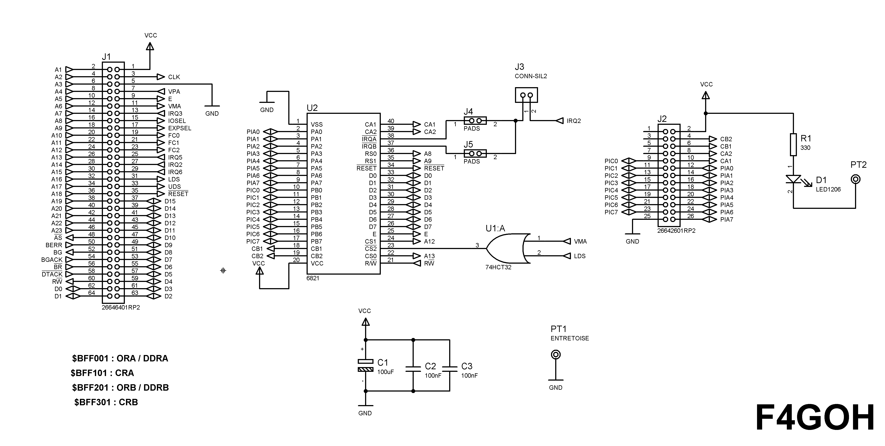
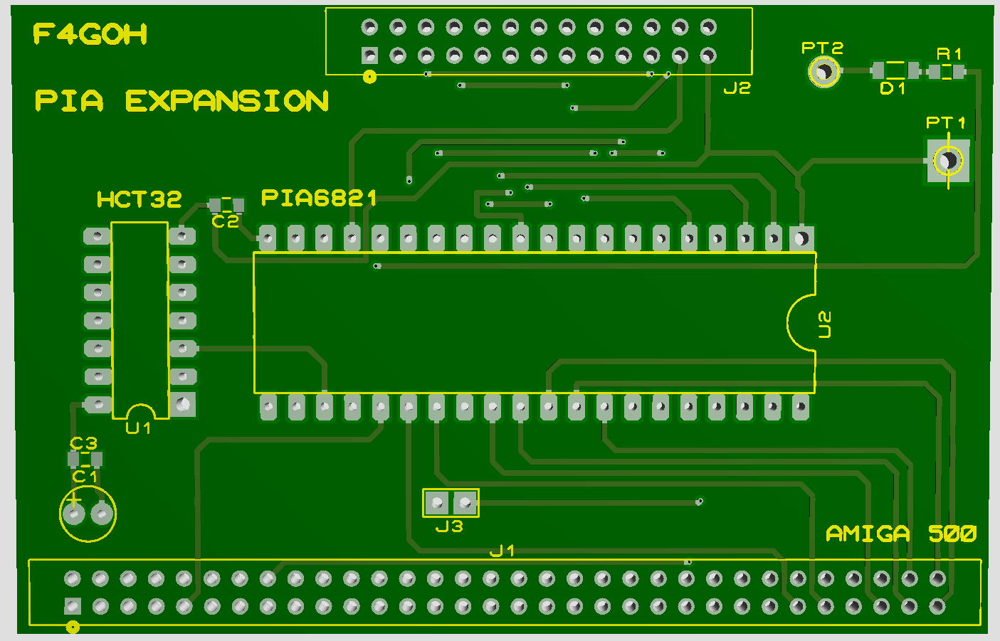

# Amiga 500 — Extension PIA 6821

Extension d'E/S basée sur un **PIA 6821**, connectée directement au port d'extension de l'Amiga 500.

## Caractéristiques

- **PIA :** 6821
- **Port A :** PA0–PA7
- **Port B :** PB0–PB7
- **E/S :** 16 bits parallèles + lignes de contrôle
- **Alimentation :** +5 V depuis le bus Amiga
- **LED :** indication de l'alimentation
- **Découplage :** C1, C2, C3 = 100 nF

# Amiga 500 — Extension PIA 6821

Extension d'E/S basée sur un **PIA 6821**, connectée directement au bus d'extension de l'Amiga 500.

## Principe

Le projet utilise la zone d'adressage `$BFFxxx`, qui est libre pour cette extension.

Lorsqu'on accède à la zone d'adresses des **CIA de l'Amiga**, Gary assure automatiquement la gestion des signaux **VPA** et **VMA** nécessaires aux accès périphériques.

Pour cette extension, on utilise la zone `$BFFxxx` afin d'implanter un **PIA 6821** sans entrer en conflit avec les CIA existants.

La sélection de la zone PIA est réalisée avec :

    A13 = 1
    A12 = 1

## Adresses du PIA

Les quatre adresses utilisées sont :

| Adresse |
|---|
| `$BFF001` |
| `$BFF101` |
| `$BFF201` |
| `$BFF301` |

Elles sont espacées de `$100`.

Le décodage utilise les bits :

    A13 = 1
    A12 = 1

Les autres bits d'adresse permettent de déterminer la position exacte dans la plage.

## Validation du /CE

La sélection du **/CE du PIA** utilise les signaux :

    VMA
    LDS

Une porte OR est utilisée pour générer la sélection du PIA.

Le PIA est sélectionné lorsque :

    VMA = 0
    LDS = 0

Avec les signaux actifs à l'état bas :

    /CE = VMA OR LDS

Table de fonctionnement :

| VMA | LDS | /CE PIA |
|---:|---:|---:|
| 0 | 0 | 0 — sélectionné |
| 0 | 1 | 1 |
| 1 | 0 | 1 |
| 1 | 1 | 1 |

Le PIA n'est donc activé que lorsque **VMA et LDS sont simultanément actifs**.

## PIA 6821

Le 6821 fournit deux ports parallèles :

    Port A : PA0–PA7
    Port B : PB0–PB7

Soit :

    16 lignes d'E/S
    + lignes de contrôle du PIA

## Architecture

    AMIGA 500
        |
    PORT D'EXTENSION
        |
       J1
        |
        +--------------------------+
        |                          |
        |      BUS D'ADRESSE       |
        |                          |
        |     A13 = 1              |
        |     A12 = 1              |
        |          |               |
        |          v               |
        |    DÉCODAGE ADRESSE      |
        |          |               |
        |          v               |
        |       PIA 6821           |
        |          |               |
        |     +----+----+          |
        |     |         |          |
        |   PORT A    PORT B       |
        |  PA0..PA7  PB0..PB7      |
        |                          |
        +--------------------------+
                   |
                   |
             VMA ----+
                     |
             LDS ----+----> OR ----> /CE PIA

## Rôle de Gary

Gary assure la logique de gestion du bus de l'Amiga 500 et notamment les signaux **VPA/VMA** utilisés lors des accès aux périphériques concernés.

Les adresses des CIA utilisent leur propre logique de sélection et Gary participe à la génération des signaux nécessaires à ces accès.

Cette extension exploite au contraire la zone libre :

    $BFFxxx

pour ajouter un PIA 6821.

## Décodage

La sélection de la zone PIA repose sur :

    A13 = 1
    A12 = 1

Puis la validation du PIA est conditionnée par :

    VMA = 0
    LDS = 0

Le signal final de sélection est :

    /CE = VMA OR LDS

## Connexion

    AMIGA 500
        |
    PORT D'EXTENSION
        |
       J1
        |
     PIA 6821
      /    \
     /      \
   PORT A  PORT B
  PA0-PA7  PB0-PB7
     \      /
      \    /
    CONNECTEURS

## Utilisation

Cette extension permet d'ajouter des E/S numériques programmables à l'Amiga 500 pour :

- Interfaces parallèles
- Cartes d'expérimentation
- Contrôle de périphériques
- Acquisition de signaux numériques
- Interfaces personnalisées
- Pilotage de matériel externe

## Résumé

**Projet :** PIA 6821 pour Amiga 500  
**Composant :** 6821  
**Port A :** PA0–PA7  
**Port B :** PB0–PB7  
**Zone d'adressage :** `$BFFxxx`  
**Décodage :** A13 = 1, A12 = 1  
**Adresses :** `$BFF001`, `$BFF101`, `$BFF201`, `$BFF301`  
**Validation /CE :** VMA = 0 et LDS = 0  
**Logique /CE :** OR de VMA et LDS  
**VPA/VMA :** gestion assurée par la logique Gary lors des accès concernés

