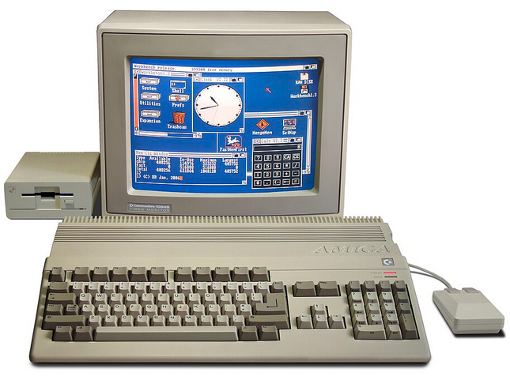
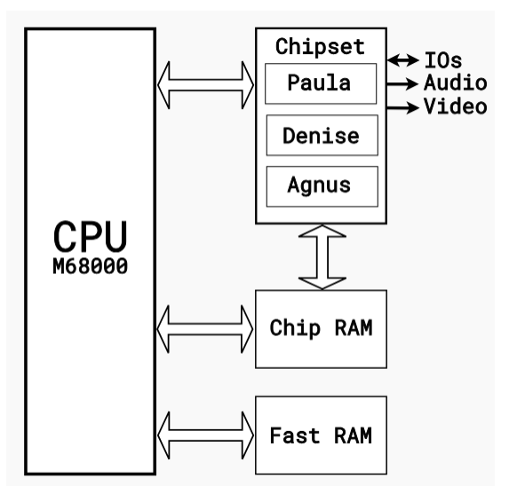

# Guide de cross-compilation Amiga sous Linux et Windows

Ce dépôt Git a pour objectif de servir de **guide pratique** pour mettre en place un environnement de **cross-compilation Amiga** moderne, aussi bien sous **Linux** que sous **Windows**.

L'objectif est de permettre de développer facilement des programmes destinés aux ordinateurs **Commodore Amiga**, sans avoir à programmer directement sur la machine d'origine.

## Ce que vous trouverez dans ce dépôt

- Installation des outils de développement.
- Configuration de l'environnement de cross-compilation.
- Compilation de programmes en **assembleur Motorola 68000**.
- Compilation de programmes en **langage C**.
- Utilisation de **Makefiles** pour automatiser les compilations.
- Création d'exécutables au format **Amiga Hunk**.
- Exemples de projets.
- Sources en provenance de disquettes des années 1990.

## Plateformes prises en charge

Ce repository couvre les deux environnements de développement les plus courants :

- Linux
- Windows

## Livres support

- [Bare-Metal Amiga Programming (OCS, ECS et AGA)](https://www.amazon.fr/dp/B09GJQ3SF6)
- [Amiga Assembly Game Programming](https://www.amazon.com/dp/B0DS9P3T8V)

## Public visé

Ce dépôt s'adresse aussi bien :

- aux débutants souhaitant découvrir la programmation Amiga ;
- aux développeurs en assembleur Motorola 68000 ;
- aux programmeurs C désirant produire des exécutables Amiga ;
- aux passionnés de rétro-informatique ;
- aux membres de la demoscene.

## Objectif

L'objectif est de fournir un environnement de développement simple, reproductible et moderne permettant de développer des logiciels Amiga depuis un ordinateur actuel.

Toutes les étapes sont expliquées afin que chacun puisse rapidement commencer à créer ses propres programmes en assembleur ou en C pour les ordinateurs Commodore Amiga.

# Commodore Amiga 500

L'**Amiga 500** (ou **A500**) est un ordinateur personnel 16/32 bits commercialisé par **Commodore International** en **1987**. Il s'agit du modèle le plus populaire de la gamme Amiga et de l'un des ordinateurs les plus emblématiques de la fin des années 1980 et du début des années 1990.

Conçu pour le grand public, l'Amiga 500 a largement contribué au succès de la plateforme grâce à ses capacités graphiques, sonores et multitâches très en avance sur son époque.

## Caractéristiques principales

- Processeur **Motorola 68000** à 7,14 MHz (PAL)
- 512 Ko de mémoire vive (extensible)
- Lecteur de disquettes 3,5 pouces de 880 Ko
- Système d'exploitation **AmigaOS**
- Souris et interface graphique livrées d'origine
- Ports joystick, souris et extensions matérielles

## Une architecture innovante

L'Amiga 500 se distingue par ses coprocesseurs spécialisés, qui déchargent le processeur principal de nombreuses tâches.

Parmi eux :

- **Agnus** : gestion de la mémoire DMA, du Blitter et du Copper.
- **Denise** : affichage graphique, bitplanes et sprites matériels.
- **Paula** : gestion du son sur 4 canaux PCM, des lecteurs de disquettes et des entrées/sorties.

Cette architecture permettait d'obtenir des animations fluides, des effets graphiques avancés et une qualité sonore exceptionnelle pour l'époque.

## Capacités graphiques

L'Amiga 500 propose plusieurs modes d'affichage :

- Résolutions jusqu'à 640 × 512 pixels (PAL entrelacé)
- Jusqu'à 32 couleurs affichées simultanément parmi une palette de 4096 couleurs
- Mode **EHB** (Extra Half-Brite) permettant 64 couleurs
- Mode **HAM** (Hold-And-Modify) affichant jusqu'à 4096 couleurs à l'écran
- 8 sprites matériels
- Scrolling matériel horizontal et vertical
- Blitter pour les copies rapides de mémoire graphique
- Copper permettant de modifier les registres vidéo pendant l'affichage

Ces fonctionnalités ont fait de l'Amiga une machine de référence pour les jeux vidéo et la démoscène.

## Capacités sonores

Le circuit **Paula** offre :

- 4 voies audio PCM 8 bits
- Lecture directe d'échantillons numériques (samples)
- Son stéréo
- Lecture DMA sans solliciter le processeur principal

Cette qualité sonore était remarquable à la fin des années 1980.

## Multitâche préemptif

L'un des points forts de l'Amiga est son système d'exploitation **AmigaOS**, capable d'exécuter plusieurs programmes simultanément grâce à un multitâche préemptif, une fonctionnalité rare sur les micro-ordinateurs familiaux de cette époque.

## Jeux et création

L'Amiga 500 est devenu une machine incontournable pour :

- les jeux vidéo
- la programmation
- la création graphique
- la musique assistée par ordinateur
- les démonstrations techniques (demos)

Des milliers de jeux et d'applications ont été développés pour cette plateforme.

## Héritage

Avec environ **2,6 millions d'exemplaires vendus**, l'Amiga 500 est le modèle le plus populaire de la famille Amiga. Il reste aujourd'hui une machine de référence pour les passionnés de rétro-informatique, la programmation en assembleur Motorola 68000 et la démoscène.

Son architecture matérielle innovante continue d'être étudiée pour comprendre les techniques de programmation bas niveau qui ont marqué l'histoire des jeux vidéo.

https://thorbjorn.itch.io/tiled

https://aamatniekss.itch.io/

https://craftpix.net

https://www.stashofcode.fr/category/amiga/page/2/

https://github.com/prb28/vscode-amiga-assembly/

https://github.com/stefanocoppi/amiga_game_prog_assembly

