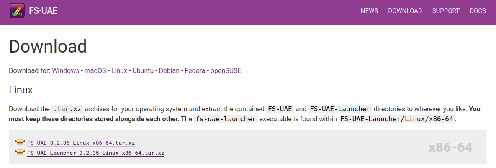
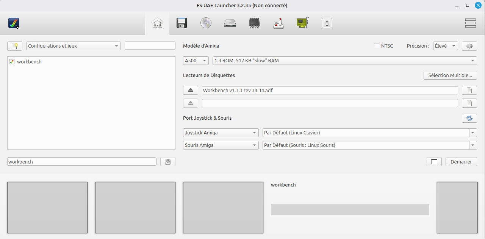
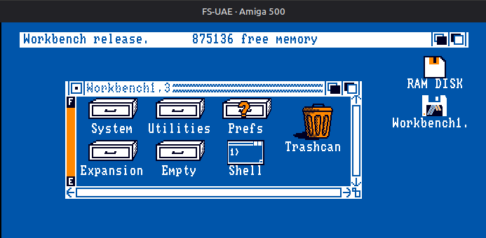

# UAE Software

[UAE software](https://fs-uae.net/download)

- Fs-uae for Linux
- Winuae for windows

## Linux install



you need to download FS-UAE and the Launcher:
- FS-UAE_3.2.35_Linux_x86-64.tar.xz
- FS-UAE-Launcher_3.2.35_Linux_x86-64.tar.xz 


```console
ale@ale-desktop:~/fs-uae-amiga$ tree
.
├── FS-UAE
│   ├── Licenses
│   ├── Linux
│   │   └── x86-64
│   │       ├── fs-uae <----the executable
│   │       ├── fs-uae.dat
│   │       ├── fs-uae-device-helper
│   │       ├── libglib-2.0.so.0
│   │       ├── libiconv.so.2
│   │       ├── libmpeg2convert.so.0
│   │       ├── libmpeg2.so.0
│   │       ├── libopenal.so.1
│   │       ├── libpng16.so.16
│   │       ├── libSDL2-2.0.so.0
│   │       ├── libz.so.1
│   │       └── Version.txt
│   ├── Locale
│   ├── Plugin.ini
│   ├── ReadMe.txt
│   └── Version.txt
└── FS-UAE-Launcher
    ├── Linux
    │   └── x86-64
    │       ├── fs-uae-launcher <----the executable
    │       └── _internal
    ├── Locale
    └── Resources
        ├── arcade.zip
        ├── fsgs.zip
        ├── launcher.zip
        └── workspace.zip

```
When you start and create profile there is some directories created in the Documents folder
Paste  Kickstart 1.3.rom and adf file like Workbench v1.3.3 rev 34.34.adf

```console
ale@ale-desktop:~/Documents/FS-UAE$ tree
.
├── Cache
│   ├── Downloads
│   │   └── 891
│   ├── Kickstarts
│   │   └── bdbd0392e05fc4226f03462a5d0e9841
│   ├── Logs
│   │   ├── debug.uae
│   │   ├── fs-uae-launcher.log.txt
│   │   └── fs-uae.log.txt
│   └── Modules
├── CD-ROMs
├── Configurations
│   └── workbench.fs-uae
├── Controllers
├── Data
│   └── Databases
│       ├── Files.sqlite
│       └── Launcher.sqlite
├── Floppies
│   └── Workbench v1.3.3 rev 34.34.adf
├── Hard Drives
├── Kickstarts
│   └── Kickstart 1.3.rom
├── System
└── Themes
```






# UAE debugger 

- put a loop waiting for the left mousebutton right after the start of the code
- put a string (dc.b. "[whatever]") near the location where I presume the faulty code
- start the program, program stays in wait-loop
- enter Shift-F12 starting the uae debugger
- search for the string > s "[whatever] < in memory, at least one address should be found
- disassembling the memory at given address, > d $xxxxxx <
- searching for the spot where I want to have the breakpoint, setting the bp with > f $xxxxxx <
- quit the uae debugger and continuing the emulation
- hit the left mousebutton
- when the program stops at the breakpoint I follow the program with > t < or > z < (tip, within a dbxx loop >z< completely handles the loop)
- anything after this is more or less related to the error, usually I seach for wrong pointers or condition codes (a wrong test or branch maybe?) 
