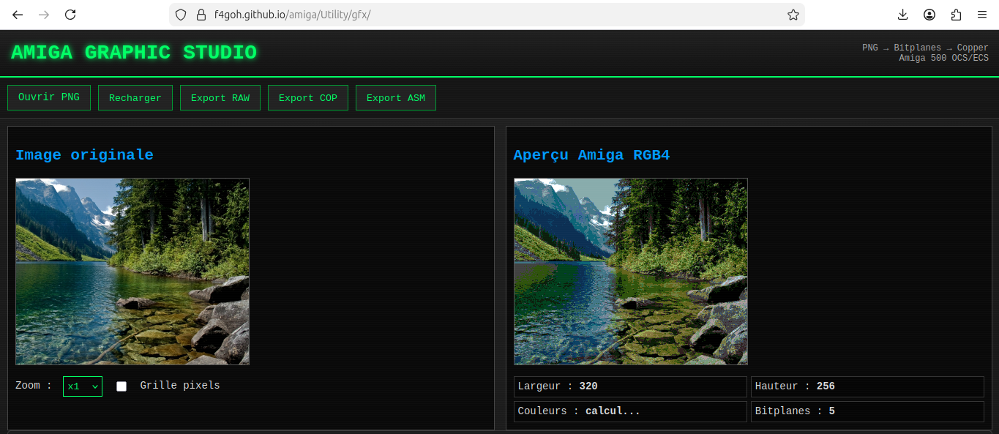
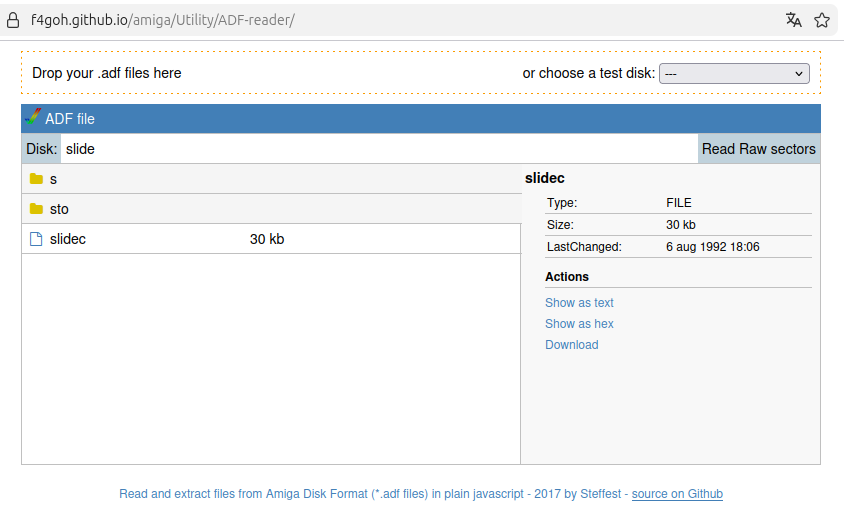
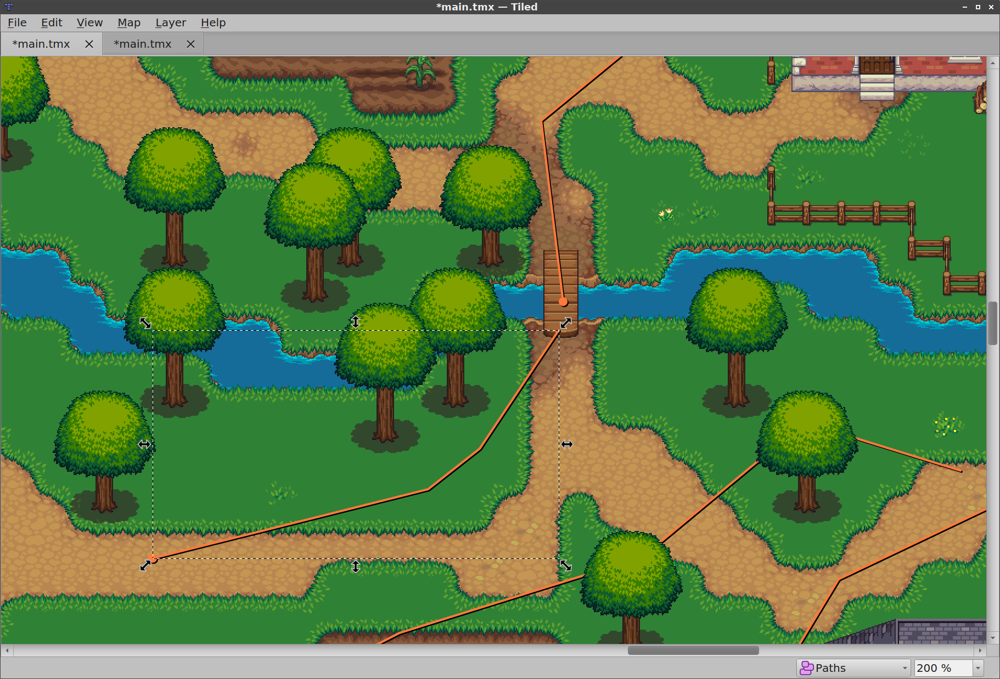

# 🕹️ Amiga Tools & Utilities

Une sélection d'outils en ligne utiles pour le développement et la création graphique sur **Amiga**.

---

## 🎨 PNG to Bitplane Converter — F4GOH

Convertissez facilement des images PNG en données **bitplanes Amiga**.

🔗 [PNG to Bitplane Converter](https://f4goh.github.io/amiga/Utility/gfx/)



---

## 💾 ADF Reader Online — F4GOH

Explorez le contenu des fichiers **ADF (Amiga Disk File)** directement depuis votre navigateur.

🔗 [ADF Reader Online](https://f4goh.github.io/amiga/Utility/ADF-reader/)



---

## 🗺️ Tiled Map Editor

Éditeur de cartes en tuiles (**tile maps**) idéal pour créer des niveaux de jeux 2D.

🔗 [Tiled Map Editor](https://thorbjorn.itch.io/tiled)



---

## ⚙️ Amiga Utility Online

Documentation et outils autour de **Moira**, l'émulateur et environnement lié au CPU Motorola 68000.

🔗 [Amiga Utility Online](https://dirkwhoffmann.github.io/Moira/docs/Overview/About.html)

---

## 📀 ADF Reader Online

Accès rapide au lecteur ADF en ligne.

🔗 [ADF Reader](https://f4goh.github.io/amiga/Utility/ADF-reader/)

---

## 🌈 Create Copper Lists Easily

Créez rapidement des **Copper Lists** pour vos effets graphiques Amiga.

🔗 [Gradient Blaster](https://gradient-blaster.grahambates.com)

---

## 📚 Ressources Amiga

| Outil | Utilité |
|------|---------|
| PNG → Bitplane | Conversion graphique Amiga |
| ADF Reader | Lecture d'images disque Amiga |
| Tiled | Création de cartes 2D |
| Moira Utilities | Outils CPU 68000 / émulation |
| Gradient Blaster | Création d'effets Copper |


# Amigeconv

**Ami**_ga_ _Ima_**ge** **Conv**_erter_ by Todi / Tulou.

A graphics converter for different Amiga bitplanes, chunky & palette formats.

## Building

In a Unix-like environment simply `make` the binary.


## Usage

```
amigeconv <options> <input> <output>
```

## Available options are:

```
ale@ale-desktop:~/amiga/Utility$ ./amigeconv 
Amigeconv (Amiga Image Converter) by Todi / Tulou - version 1.1.1 (2025-08-03)

Usage: amigeconv <options> <input> <output>

-f, --format bitplane,chunky,palette,sprite         Desired output file format.
-p, --palette pal8,pal4,pal32,loadrgb4,loadrgb32    Desired palette file format.
-l, --interleaved                                   Data in output file is stored in interleaved format, only valid with bitplane output file format.
-m, --mask [inverted]                               Data in output file is stored as a mask, only valid with bitplane output file format.
-d, --depth 1-8                                     Number of bitplane saved in the output file, only valid with bitplane, sprite or chunky output file format.
-c, --colors 1-256                                  Number of colors saved in the output file, only valid with palette output file format.
-x, --copper                                        Generate copper list, only valid with palette output file format.
-w, --width 16,32,64                                Width, only valid with sprite output file format.
-t, --controlword                                   Write control word, only valid with sprite output file format.
-a, --attached                                      Attach mode sprite, only valid with sprite output file format.
-n, --piccon                                        Use PicCon compatible color conversion for 4 bit palette, only valid with palette output file format.
```


### Examples:


```
amigeconv -f bitplane -d 8 font.png font.raw
amigeconv -f bitplane -m font.png font.raw
amigeconv -f chunky font.png font.chk
amigeconv -f palette -p pal8 font.png font.pal8
amigeconv -f sprite -t font.png font.spr
```

## Install

### For Linux, Mac & Windows:

[Download precompiled binary](https://github.com/tditlu/amigeconv/releases)
